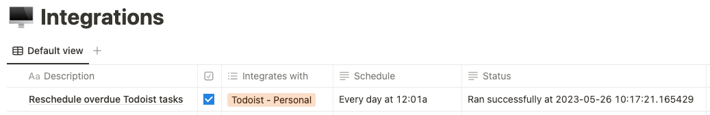

# Reschedule overdue Todoist tasks

Reschedules overdue Todoist tasks

## Configuration notes

- Install [Todoist's official Python SDK](https://developer.todoist.com/rest/v2/?python#python-sdk)

```
pip install todoist-api-python
```
- Create database in Notion to manage integration with properties
  - Active (Checkbox)
  - Status (Text)



- Make sure the integration user has the appropriate permissions for this page
- Create `constants_ads_notion_integration.json` in script directory that looks like
```
{
  "todoist_api_token": "------------------------",
  "todoist_api_version": "v2",
  "notion_api_token": "secret_------------------------",
  "notion_api_version": "2022-06-28",
  "integration_page_id": "------------------------"
}
```
where the Notion page IDs can be retrieved from its URL
- Schedule the script with `cron`: for example, to execute every night at 12:01am,

```
1 0 * * * /usr/bin/python3 /home/ubuntu/scripts/todoist-reschedule-overdue/todoist-reschedule-overdue.py >> cron.log 2>&1
```